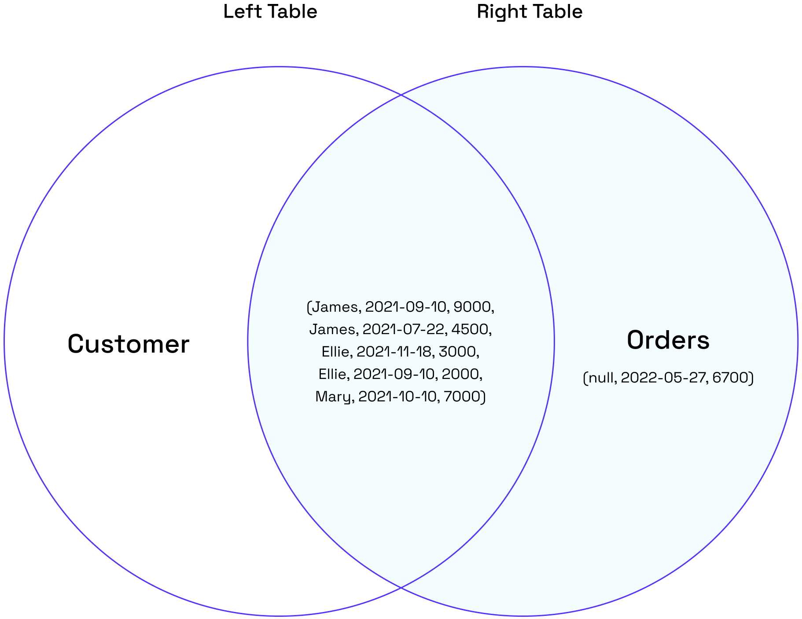

## Overview

The `RIGHT JOIN` returns **all** matching records from the right table combined with the left table. Even if there are no match records in the left table, the `RIGHT JOIN` will still return a row in the result, but with `NULL` in each column from the left table.

:::hint{type="success"}
✅ We support table aliasing used in the `RIGHT JOIN` clause.
:::

## Syntax

### a) Basic Syntax

```pgsql
SELECT column_1, column_2...
FROM table_1
RIGHT JOIN table_2
ON table_1.matching_field = table2.matching_field;
```

In the above syntax:

1.  `SELECT column_1, column_2...` defines the **columns** from both tables where we want to display data.

2.  `FROM table_1`, defines the **left table** with table_1 in the FORM clause.

3.  `RIGHT JOIN table_2` defines the **right table** with table_2 in the RIGHT JOIN condition.

4.  `ON table_1.matching_field = table2.matching_field` sets the join condition after the **ON** keyword with the matching field between the two tables.

### b) Syntax with an Alias

You can use an alias to refer to the table’s name. The results will stay the same. It only helps to write the query easier.

```pgsql
SELECT A.column_1, B.column_2...
FROM table_1 A //table_1 as A
RIGHT JOIN table_2 B //table_2 as B
ON A.matching_field = B.matching_field;
```

## Example

&#x20; customer table&#x20;

```pgsql
CREATE TABLE customer (
  id int NOT NULL,
  customer_name string
);

INSERT INTO customer
    (id, customer_name)
VALUES
    (201011,'James'),
    (200914,'Harry'),
    (201029,'Ellie'),
    (201925,'Mary');
```

```pgsql
SELECT * FROM customer;
```

It will create a table as shown below:

```pgsql
+-----------+----------------+
| id        | customer_name  |
+-----------+----------------+
| 201011    | James          |
| 200914    | Harry          |
| 201029    | Ellie          |
| 201925    | Mary           |
+-----------+----------------+
```

\*\* **orders table\*\***

```pgsql
CREATE TABLE orders (
  order_id int NOT NULL,
  order_date date,
  order_amount int,
  customer_id int
);

INSERT INTO orders
    (order_id, order_date, order_amount, customer_id)
VALUES
    (181893,'2021-10-08',3000,201029),
    (181894,'2021-11-18',2000,201029),
    (181891,'2021-10-08',9000,201011),
    (181892,'2021-10-08',7000,201925),
    (181897,'2021-10-08',6000,null),
    (181899,'2021-10-08',4500,201011);
```

```pgsql
SELECT * FROM orders;
```

It will create a table as shown below:

```pgsql
+------------+------------------+---------------+-------------+
| order_id   | order_date       | order_amount  | customer_id |
+------------+------------------+---------------+-------------+
| 181893     | 2021-10-08       | 3000          | 201029      |
| 181894     | 2021-11-18       | 2000          | 201029      |
| 181891     | 2021-09-10       | 9000          | 201011      |
| 181892     | 2021-10-10       | 7000          | 201925      |
| 181897     | 2022-05-27       | 6700          | null        |
| 181899     | 2021-07-22       | 4500          | 201011      |
+------------+------------------+---------------+-------------+
```

---

1\) Based on the above tables, we can write a `RIGHT JOIN` query as follows:

```pgsql
SELECT customer_name, order_date, order_amount
FROM customer
RIGHT JOIN orders
ON customer.id = orders.customer_id;
```

- The **customer** =\*\* **left table** \*\*and the **orders** = right table.

- Then it combines the values from the **orders** table using the **customer_id** and matches the records using the **id** column from the **customer **table.

- If the records are equal, a new row will be created with `customer_name`\*\* **and** \*\*`order_amount` columns as defined in the `SELECT` clause.

- **ELSE** will still create a new row with a `NULL` value from the left table (**customer)**.&#x20;

2\) The above query will give the following result:

```pgsql
+------------------+----------------+-----------------+
| customer_name    | order_date     | order_amount    |
+------------------+----------------+-----------------+
| James            | 2021-09-10     | 9000            |
| James            | 2021-07-22     | 4500            |
| Ellie            | 2021-10-08     | 3000            |
| Ellie            | 2021-11-18     | 2000            |
| Mary             | 2021-10-10     | 7000            |
| null             | 2022-05-27     | 6700            |
+------------------+----------------+-----------------+
```

Based on the data from the **customer** and **orders** tables:

- The order id: `181893` matches the customer: `Ellie.`

- The order id: `181894` matches the customer: `Ellie`.

- The order id: `181891` matches the customer: `James`.

- The order id: `181899` matches the customer: `James`.

- The order id: `181892` matches the customer: `Mary`.

- The order id: `181897` doesn’t match with any customer. Thus the customer_name column is filled with: `null`.

:::hint{type="info"}
💡 A **customer** can have zero or many **orders**. An item from **orders** belongs to zero or one **customer**.
:::

The following Venn diagram illustrates the `RIGHT JOIN`:


