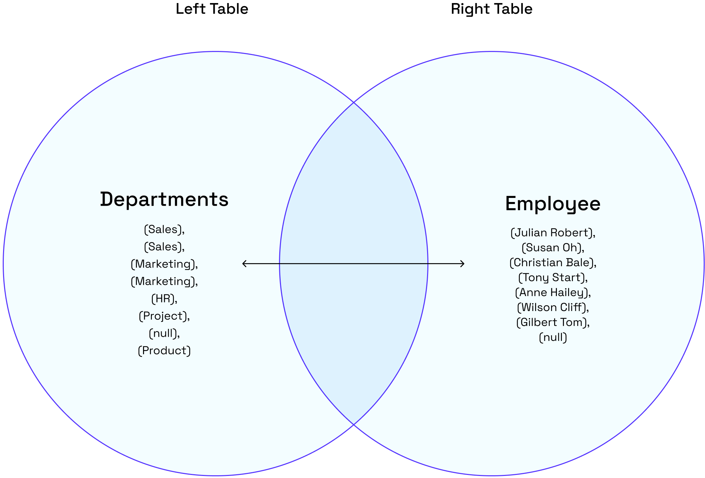
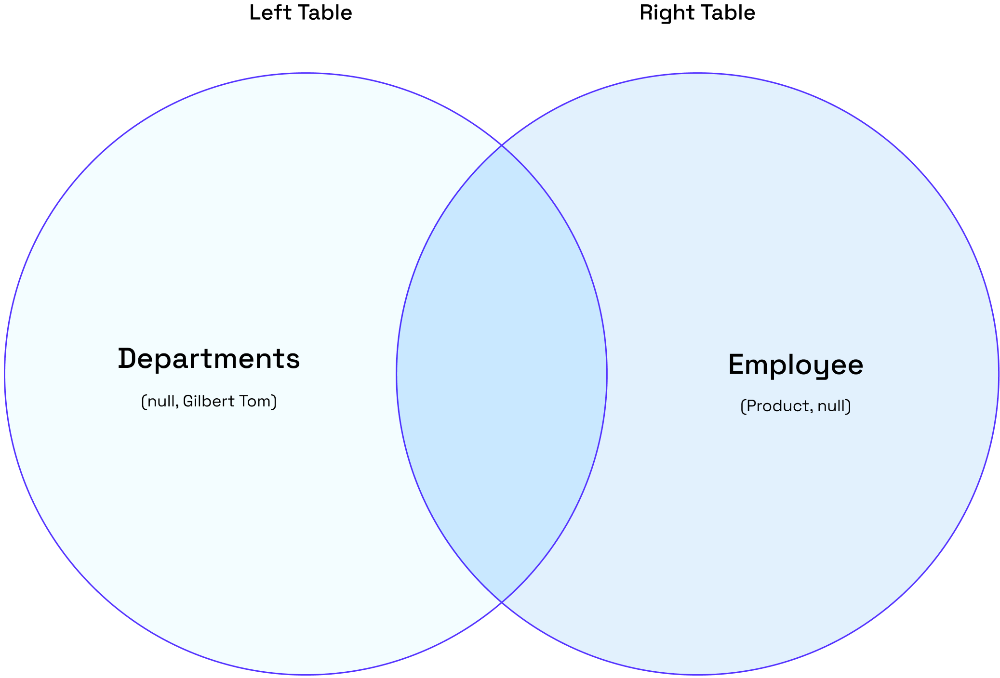

## Overview

The `OUTER JOIN` **or **`FULL OUTER JOIN` returns all the records from the selected fields between the two tables (left table & right table) whether the join condition is met or not.

### **Inner Join 🆚 Outer Join**

The most significant difference between an `INNER JOIN` and an `OUTER JOIN` is that the `INNER JOIN` only returns the information from both tables which are common and related to each other. The OUTER JOIN will return all rows (matched/unmatched) from both tables.&#x20;

:::hint{type="success"}
🙋🏻‍♂️ We support table aliasing used in the OUTER JOIN clause.
:::

## Syntax

### a) Basic Syntax

```pgsql
SELECT column_1, column_2...
FROM table_1
FULL OUTER JOIN table_2
ON table_1.matching_field = table2.matching_field;
```

In the above syntax:

1.  `SELECT column_1, column_2...` defines the **columns **from both tables where we want to display data.

2.  `FROM table_1` represents the **left table **with table_1 in the FROM clause.

3.  &#x20;`FULL OUTER JOIN table_2` represents the **right table** with table_2 in the FULL OUTER JOIN condition.

4.  `ON table_1.matching_field = table2.matching_field` sets the join condition after the **ON** keyword with the matching field between the two tables.&#x20;

### b) Syntax with an Alias

You can use an alias to refer to the table’s name. The results will stay the same. It only helps to write the query easier.

```pgsql
SELECT A.column_1, B.column_2...
FROM table_1 A //table_1 as A
FULL OUTER JOIN table_2 B //table_2 as B
ON A.matching_field = B.matching_field;
```

:::hint{type="info"}
💡 If there are no matched records from the joined tables, the `NULL` values will return in every column of the table that doesn’t have the matching record.
:::

## Example

\*\* **departments table\*\***

```pgsql
CREATE TABLE departments (
	department_id int,
	department_name string
);
INSERT INTO departments (department_id,department_name)
VALUES
	(1001, 'Sales'),
	(1002, 'Marketing'),
	(1003, 'HR'),
	(1004, 'Project'),
	(1005, 'Product');
```

```pgsql
SELECT * FROM departments;
```

It will create a **departments **table as shown below:

```pgsql
+----------------+------------------+
| department_id  | department_name  |
+----------------+------------------+
| 1001           | Sales            |
| 1002           | Marketing        |
| 1003           | HR               |
| 1004           | Project          |
| 1005           | Product          |
+----------------+------------------+
```

\*\* **employee table\*\***

```pgsql
CREATE TABLE employee (
	employee_id int,
	employee_name string,
	dept_id int
);
INSERT INTO employee (
	employee_id,
	employee_name,
    dept_id
)
VALUES
	(2001,'Tony Stark', 1002),
	(2002,'Christian Bale', 1002),
	(2003,'Anne Hailey', 1003),
	(2004,'Wilson Cliff', 1004),
	(2005,'Susan Oh', 1001),
	(2006,'Julian Robert', 1001),
    (2007,'Gilbert Tom', null);
```

```pgsql
SELECT * FROM employee;
```

It will create an **employee **table as shown below:

```pgsql
+--------------+-------------------+------------+
| employee_id  | employee_name     | dept_id    |
+--------------+-------------------+------------+
| 2001         | Tony Stark        | 1002       |
| 2002         | Christian Bale    | 1002       |
| 2003         | Anne Hailey       | 1003       |
| 2004         | Wilson Cliff      | 1004       |
| 2005         | Susan Oh          | 1001       |
| 2006         | Julian Robert     | 1001       |
| 2007         | Gilbert Tom       | null       |
+--------------+-------------------+------------+
```

---

### #Case 1: FULL OUTER JOIN

1\) Based on the above tables, we can write an `OUTER JOIN` query as follows:

```pgsql
SELECT employee_name, department_name
FROM departments
FULL OUTER JOIN employee
ON departments.department_id = employee.dept_id;
```

2\) The result will show every department with an employee and the employee who works under a specific department.

3\) It also includes every department that does not have any employees and the employees who do not belong to a specific department.

```pgsql
+-------------------+-------------------+
| employee_name     | department_name   |
+-------------------+-------------------+
| Julian Robert     | Sales             |
| Susan Oh          | Sales             |
| Christian Bale    | Marketing         |
| Tony Stark        | Marketing         |
| Anne Hailey       | HR                |
| Wilson Cliff      | Project           |
| Gilbert Tom       | null              |
| null              | Product           |
+-------------------+-------------------+
```

The following Venn diagram illustrates the FULL OUTER JOIN:



---

### #Case 2: `FULL OUTER JOIN` with `WHERE` Clause

\***\*a) Employee\*\***

1\) We can look up the department that does not have any employees by adding a `WHERE` clause and `NULL` as the following query:

```pgsql
SELECT employee_name, department_name
FROM departments
FULL OUTER JOIN employee
ON departments.department_id = employee.dept_id
WHERE employee_name IS NULL;
```

2\) The result will indicate that the **Product** department doesn’t have any employees 👨🏻‍💼

```pgsql
+------------------+--------------------+
| employee_name    | department_name    |
+------------------+--------------------+
| null             | Product            |
+------------------+--------------------+
```

\***\*b) Department\*\***

1\) Let’s find out the employee who doesn’t belong to any department by adding a WHERE clause and NULL as the following query:&#x20;

```pgsql
SELECT employee_name, department_name
FROM employee
FULL OUTER JOIN departments
ON employee.dept_id = departments.department_id
WHERE department_name IS NULL;
```

2\) The result will show that **Gilbert Tom **doesn’t belong to any department 👨🏻‍💼

```pgsql
+------------------+--------------------+
| employee_name    | department_name    |
+------------------+--------------------+
| Gilbert Tom      | null               |
+------------------+--------------------+
```

The following Venn diagram illustrates how the FULL OUTER JOIN works for the department and employee with a null value:


