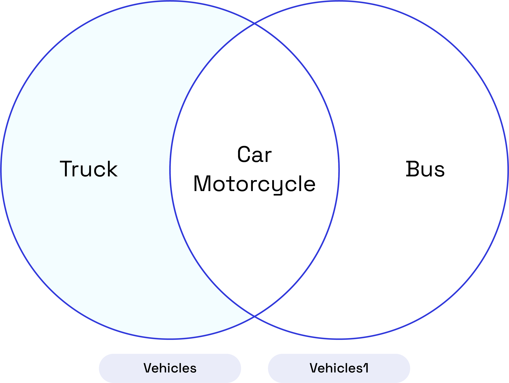
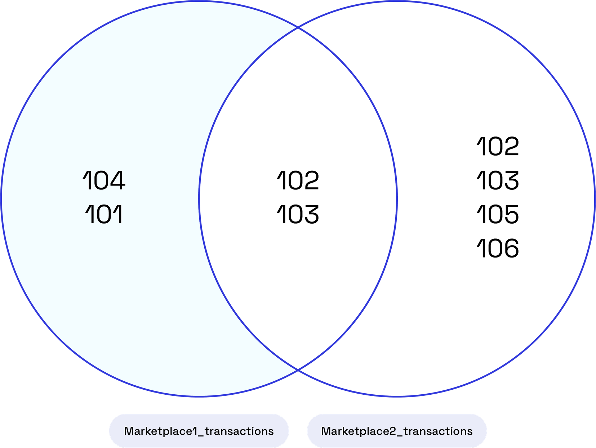

## EXCEPT

### Overview

The `EXCEPT` combines the result sets of two or more tables and retrieves rows specific to the first `SELECT` statement but not present in the subsequent ones.

### Syntax

The syntax for the `EXCEPT` is as follows:

```pgsql
SELECT value1, value2, ... value_n
FROM table1
EXCEPT
SELECT value1, value2, ... value_n
FROM table2;
```

The parameters from the syntax are explained below:

- `value1, value2, ... value_n`: The columns you want to retrieve.

- `table1, table2`: The tables from which you wish to retrieve records.

### Example

Let's assume you have two tables: `vehicles` and `vehicles1`. You want to find the vehicle which was present in 2021 but is not present in 2022:

```pgsql
CREATE TABLE vehicles (
    vhc_id INT,
    vhc_name TEXT
);

CREATE TABLE vehicles1 (
    vhc_id INT,
    vhc_name TEXT
);

INSERT INTO vehicles VALUES
(1, 'Truck'),
(2, 'Car'),
(3, 'Motorcycle');

INSERT INTO vehicles1 VALUES
(2, 'Car'),
(3, 'Bus'),
(4, 'Motorcycle');
```

Display the tables with the query below:

```pgsql
SELECT * FROM vehicles;
SELECT * FROM vehicles1;
```

```pgsql
vhc_id |  vhc_name
--------+------------
      1 | Truck
      2 | Car
      3 | Motorcycle

 vhc_id |  vhc_name
--------+------------
      2 | Car
      3 | Bus
      4 | Motorcycle
```

Using the `EXCEPT` to find employees present in 2021 but not in 2022:

```pgsql
SELECT vhc_name FROM vehicles
EXCEPT
SELECT vhc_name FROM vehicles1;
```

The result will include the names of employees who were present in 2021 but are not present in 2022:

```pgsql
vhc_name
----------
 Truck
```

From the diagram below, we learn that the result is a list of vehicle names present in the first table (`vehicles`) but not found in the second table (`vehicles1`). In this case, the result is the vehicle name "Truck."



## EXCEPT ALL

### Overview

The `EXCEPT ALL` allows you to find rows specific to the first `SELECT` statement while preserving duplicate entries.

### Syntax

The syntax for the `EXCEPT ALL` is similar to `EXCEPT`:

```pgsql
SELECT value1, value2, ... value_n
FROM table1
EXCEPT ALL
SELECT value1, value2, ... value_n
FROM table2;
```

The parameters from the syntax are explained below:

- `value1, value2, ... value_n`: The columns you want to retrieve.

- `table1, table2`: The tables from which you wish to retrieve records.

<Note>The data types of corresponding columns in the `SELECT` queries must be compatible.</Note>

### Example #1

You aim to identify customers who have bought products from one marketplace but have not purchased from another. Start by creating the tables and populating them with relevant data.

```pgsql
CREATE TABLE marketplace1_transactions (
    customer_id INT,
    product_id INT,
    amount FLOAT
);

CREATE TABLE marketplace2_transactions (
    customer_id INT,
    product_id INT,
    amount FLOAT
);

INSERT INTO marketplace1_transactions VALUES
(101, 1, 100.00),
(102, 2, 150.00),
(103, 3, 200.00),
(104, 1, 120.00);

INSERT INTO marketplace2_transactions VALUES
(102, 3, 180.00),
(103, 2, 160.00),
(105, 4, 90.00),
(106, 1, 110.00);
```

Display the tables using the query below:

```pgsql
SELECT * FROM marketplace1_transactions;
SELECT * FROM marketplace2_transactions;
```

```pgsql
customer_id | product_id | amount
-------------+------------+--------
         101 |          1 |    100
         102 |          2 |    150
         103 |          3 |    200
         104 |          1 |    120

 customer_id | product_id | amount
-------------+------------+--------
         102 |          3 |    180
         103 |          2 |    160
         105 |          4 |     90
         106 |          1 |    110
```

Using the `EXCEPT ALL` to find customers who have purchased products from one marketplace but not from the other:

```pgsql
SELECT customer_id FROM marketplace1_transactions
EXCEPT ALL
SELECT customer_id FROM marketplace2_transactions;
```

This result will show a `customer_id` who has only transacted in the first marketplace and has not engaged in any corresponding transactions in the second marketplace.

```pgsql
customer_id
-------------
         104
         101
```

The diagram below shows a list of customer-product pairs found in the first marketplace (`marketplace1_transactions`) but missing in the second marketplace (`marketplace2_transactions`).&#x20;



### Example #2

Let’s create two tables, `left_array_values` and `right_array_values`, to hold sets of values.

```pgsql
CREATE TABLE left_array_values (
    value INT
);

CREATE TABLE right_array_values (
    value INT
);

INSERT INTO left_array_values VALUES (1), (1), (3);
INSERT INTO right_array_values VALUES (1), (2);
```

View the contents of the two arrays before performing the comparison.

```pgsql
SELECT * FROM left_array_values;
SELECT * FROM right_array_values;
```

Upon execution, the tables will appear as follows:

```pgsql
value
-------
     1
     1
     3

 value
-------
     1
     2
```

We will now use the `EXCEPT ALL` operation to compare the values within the arrays, focusing on unique elements while retaining duplicate entries.

```pgsql
SELECT value
FROM left_array_values
EXCEPT ALL
SELECT value
FROM right_array_values;
```

The `EXCEPT ALL` operation processes each element individually from both inputs at a time. The comparison occurs element-wise, leading to the inclusion of both 1 and 3 in the final result.&#x20;

```pgsql
value
-------
     3
     1
```
