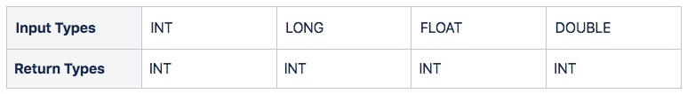

## Overview

The `COUNT()` function allows you to get the number of records that match a specific condition.

The input and return types we support can be seen in the table below.



<Info>The output will return the number of rows in a table regardless of the input types.</Info>

## Examples

In this example, we will use an orders table that stores details of the purchase transactions:

```pgsql
CREATE TABLE orders (
    orderid int,
    custname text,
    orderproduct text,
    ordertotal real
);
INSERT INTO orders (orderid, custname, orderproduct, ordertotal)
VALUES
(9557411, 'Maya', 'Jeans', 10.5),
(9557421, 'Aaron', 'T-Shirt', 9.2),
(9557451, 'Alex', 'Hat', 10.8),
(9557311, 'Will', 'Hat', 8.5),
(9557321, 'Will', 'T-Shirt', 12.15),
(9557351, 'Maya', 'T-Shirt', 9.5),
(9557221, 'Maya', 'Jeans', 11.02),
(9557251, 'Alex', 'Jeans', 11.09),
(9557231, 'Aaron', 'Hat', 14.56),
(9557281, 'Aaron', 'Hat', 12.15),
(9557291, 'Will', 'T-Shirt', 13.1);
```

```pgsql
SELECT * FROM orders;
```

The above query will show the following table:

```pgsql
+----------+-----------+---------------+-------------+
| orderid  | custname  | orderproduct  | ordertotal  |
+----------+-----------+---------------+-------------+
| 9557411  | Maya      | Jeans         | 10.5        |
| 9557421  | Aaron     | T-Shirt       | 9.2         |
| 9557451  | Alex      | Hat           | 10.8        |
| 9557311  | Will      | Hat           | 8.5         |
| 9557321  | Will      | T-Shirt       | 12.15       |
| 9557351  | Maya      | T-Shirt       | 9.5         |
| 9557221  | Maya      | Jeans         | 11.02       |
| 9557251  | Alex      | Jeans         | 11.09       |
| 9557231  | Aaron     | Hat           | 14.56       |
| 9557281  | Aaron     | Hat           | 12.15       |
| 9557291  | Will      | T-Shirt       | 13.1        |
+----------+-----------+---------------+-------------+
```

### #Case 1: `COUNT()` with a single expression

The following example will return the number of all orders in the orders table:

```pgsql
SELECT COUNT(*) FROM orders;
```

The final result will be as follows:

```pgsql
+-------+
| count |
+-------+
| 11    |
+-------+
```

### #Case 2: `COUNT()` with a `GROUP BY` clause

This example will combine the `COUNT()` function and the `GROUP BY` clause.

- The `GROUP BY` clause groups the orders based on the customer’s name.

- The `COUNT()` function counts the orders for each customer.

```pgsql
SELECT custname, COUNT (orderid)
FROM orders
GROUP BY custname;
```

It will display the output as shown below:

```pgsql
+-----------+--------+
| custname  | count  |
+-----------+--------+
| Aaron     | 3      |
| Alex      | 2      |
| Will      | 3      |
| Maya      | 3      |
+-----------+--------+
```

### #Case 3: `COUNT()` with a `HAVING` clause

In this example, we combine the `COUNT()` function and the `HAVING` clause to apply a specific condition to find customers who have made more than two orders:

```pgsql
SELECT custname, COUNT (orderid)
FROM orders
GROUP BY custname
HAVING COUNT (orderid) > 2;
```

- The `GROUP BY` clause groups the orders based on the customer’s name.

- The `HAVING` clause will filter only customers with more than two order IDs.

- The `COUNT()` function counts the orders for each customer.

```pgsql
+-----------+--------+
| custname  | count  |
+-----------+--------+
| Aaron     | 3      |
| Will      | 3      |
| Maya      | 3      |
+-----------+--------+
```
