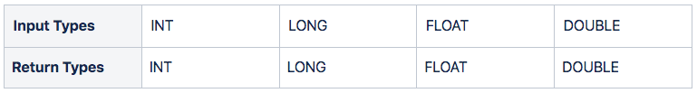

## Overview

`MIN()` function returns the minimum value from a set of records.

The input and return types we support can be seen in the table below.



:::hint{type="success"}
✅ The return will be the same as the data type used as the input values.
:::

💡**Special cases:**

- Returns `NULL` if there are no input rows or `NULL` values.

- Returns `NaN` if the input contains a `NaN`.

## Examples

We have a movies table that stores the movie details, such as the movie’s title, category, and IMDb rating:

```pgsql
CREATE TABLE movies (
    movieid int,
    moviename string,
    moviecategory string,
    imdbrating real
);
INSERT INTO movies (movieid, moviename, moviecategory, imdbrating)
VALUES
(8557411, 'The Shawshank Redemption', 'Drama', 9.4),
(8557421, 'Life Is Beautiful', 'Romance', 8.4),
(8557451, 'The Godfather', 'Crime', 9.3),
(8557311, 'Prisoners', 'Thriller', 8.5),
(8557321, 'Inception', 'Science Fiction', 9),
(8557351, 'The Dark Knight', 'Action', 9.2),
(8557221, 'Coco', 'Drama', 8.2),
(8557251, 'The Sixth Sense', 'Horror', 8.1),
(8557231, 'Kill Bill: Vol. 1', 'Action', 8.1),
(8557281, 'The Notebook', 'Romance', 7.8),
(8557291, 'Forrest Gump', 'Drama', 8);
```

```pgsql
SELECT * FROM movies;
```

It will create a table as shown below:

```pgsql
+---------+--------------------------+-----------------+-------------+
| movieid | moviename                | moviecategory   | imdbrating  |
+---------+--------------------------+-----------------+-------------+
| 8557411 | The Shawshank Redemption | Drama           | 9.4         |
| 8557421 | Life Is Beautiful        | Romance         | 8.4         |
| 8557451 | The Godfather            | Crime           | 9.3         |
| 8557311 | Prisoners                | Thriller        | 8.5         |
| 8557321 | Inception                | Science Fiction | 9           |
| 8557351 | The Dark Knight          | Action          | 9.2         |
| 8557221 | Coco                     | Drama           | 8.2         |
| 8557251 | The Sixth Sense          | Horror          | 8.1         |
| 8557231 | Kill Bill: Vol. 1        | Action          | 8.1         |
| 8557281 | The Notebook             | Romance         | 7.8         |
| 8557291 | Forrest Gump             | Drama           | 8           |
+---------+--------------------------+-----------------+-------------+
```

### #Case 1: `MIN()` with a single expression

For example, you might want to know what is the lowest rating of all stored movies:

```pgsql
SELECT MIN(imdbRating) AS "Lowest Rating"
FROM movies;
```

It will return the following output:

```pgsql
+----------------+
| Lowest Rating  |
+----------------+
| 7.8            |
+----------------+
```

### #Case 2: `MIN()` with `GROUP BY` clause

For this example, we use a `GROUP BY` clause to group the movie categories, then use `MIN()` to get the lowest rating in each movie category.

```pgsql
SELECT movieCategory AS "Movie Category", MIN(imdbRating) AS "Lowest Rating"
FROM movies
GROUP BY movieCategory;
```

It will display the lowest rating from a group of `movieCategory` as shown below:

```pgsql
+------------------+----------------+
| Movie Category   | Lowest Rating  |
+------------------+----------------+
| Thriller         | 8.5            |
| Romance          | 7.8            |
| Crime            | 9.3            |
| Horror           | 8.1            |
| Drama            | 8              |
| Action           | 8.1            |
| Science Fiction  | 9              |
+------------------+----------------+
```

### #Case 3: `MIN()` in a subquery

In this example, we can get a movie that has the lowest rating by using a subquery:

- First, the subquery will select the lowest rating using a `MIN()` function and store it as the `IMDbRating`.

- Then, the outer query selects the movie with a rating equal to the lowest rating stored in the `IMDbRating`.

```pgsql
SELECT movieName, IMDbRating
FROM movies
WHERE IMDbRating = (
    SELECT MIN(IMDbRating)
    FROM movies
);
```

It will return the following result:

```pgsql
+---------------+-------------+
| moviename     | imdbrating  |
+---------------+-------------+
| The Notebook  | 7.8         |
+---------------+-------------+
```
