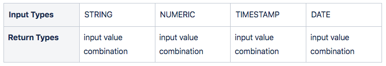

## Overview

The `CONCAT()` function is used to concatenate all inputs that consist of one or more values into one result.

The input and return types we support can be seen in the table below.



💡**Special cases:** Returns `NULL` if there are no input rows or `NULL` values.

## Examples

### Case 1: Basic `CONCAT()` function

The below example uses the `CONCAT()` function to concatenate three values = into a single result:

```pgsql
SELECT CONCAT ('Oxla', '.', 'com') AS "Website";
```

The final result will be as follows:

```pgsql
+------------+
| Website    |
+------------+
| Oxla.com   |
+------------+
```

### Case 2: `CONCAT()` function using column

We have an example of a **payment** table that stores customer payment data.

```pgsql
CREATE TABLE payment (
  paymentid int,
  custFirstName string,
  custLastName string,
  product string,
  ordertotal int
);
INSERT INTO payment
    (paymentid, custFirstName, custLastName, product, ordertotal)
VALUES
    (9557451,'Alex','Drue','Latte',2.10),
    (9557421,'Lana','Rey','Latte',2.10),
    (9557411,'Tom','Hanks','Americano',1.85),
    (9557351,'Maya','Taylor','Cappuccino',2.45),
    (9557321,'Smith','Jay','Cappuccino',2.45),
    (9557311,'Will','Ritchie','Americano',1.85);
```

```pgsql
SELECT * FROM payment;
```

The above query will display the following table:

```pgsql
+------------+----------------+----------------+--------------+---------------+
| paymentid  | custFirstName  | custLastName   | product      | ordertotal    |
+------------+----------------+----------------+--------------+---------------+
| 9557451    | Alex           | Drue           | Latte        | 2.10          |
| 9557421    | Lana           | Rey            | Latte        | 2.10          |
| 9557411    | Tom            | Hanks          | Americano    | 1.85          |
| 9557351    | Maya           | Taylor         | Cappuccino   | 2.45          |
| 9557321    | Smith          | Jay            | Cappuccino   | 2.45          |
| 9557311    | Will           | Ritchie        | Americano    | 1.85          |
+------------+----------------+----------------+--------------+---------------+
```

The following query will concatenate values in the `custFirstName` and `custLastName` columns of the **payment** table:

```pgsql
SELECT CONCAT  (custFirstName, ' ', custLastName) AS "Customer Name"
FROM payment;
```

It will display an output where spaces separate the first and last names.

```pgsql
+-----------------+
| Customer Name   |
+-----------------+
| Tom Hanks       |
| Lana Rey        |
| Alex Drue       |
| Will Ritchie    |
| Smith Jay       |
| Maya Taylor     |
+-----------------+
```

### Case 3: CONCAT() function with NULL

We use the `CONCAT()` function in the following example to concatenate a string with a `NULL` value:

```pgsql
SELECT CONCAT('Talent Source ',NULL) AS "concat";
```

The result shows that the `CONCAT` function will skip the `NULL` value:

```pgsql
+------------------+
| concat           |
+------------------+
| Talent Source    |
+------------------+
```
